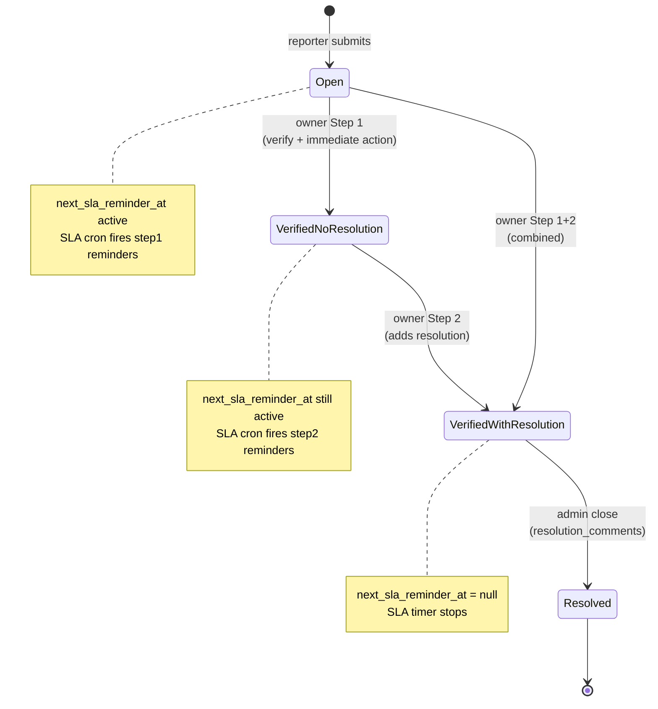
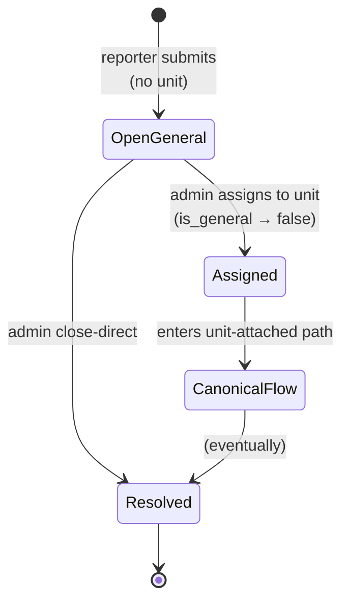
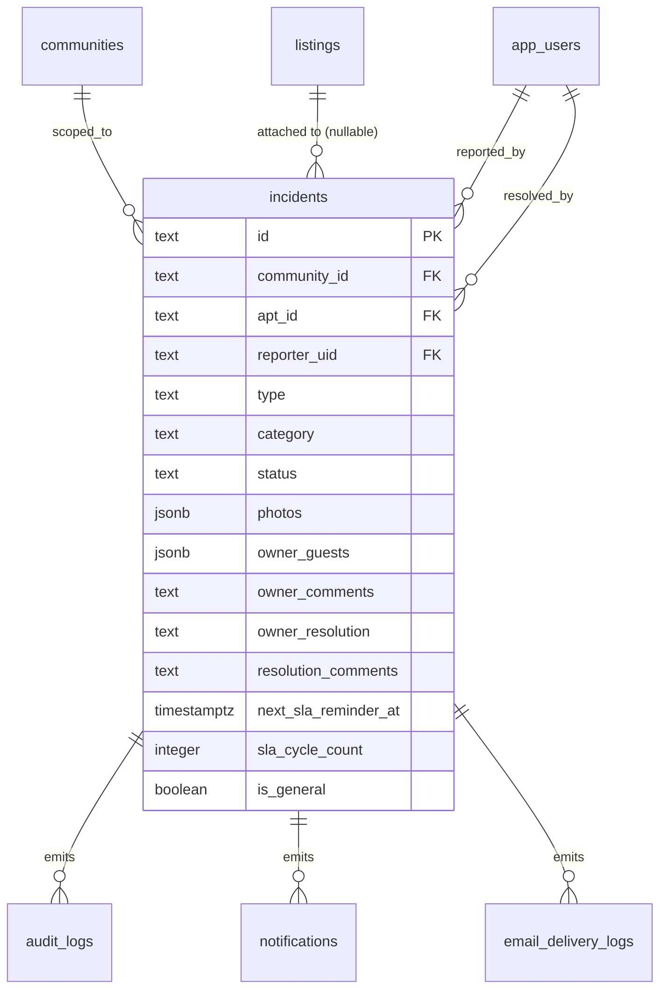
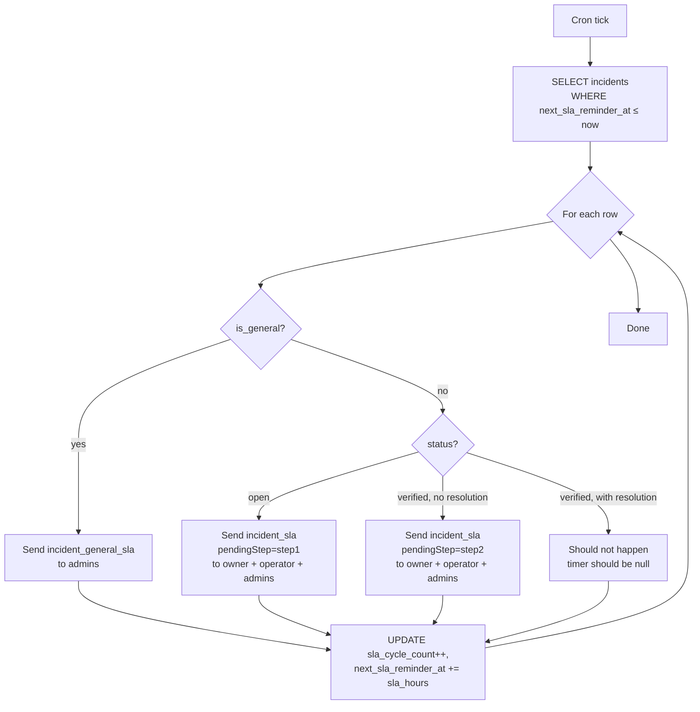
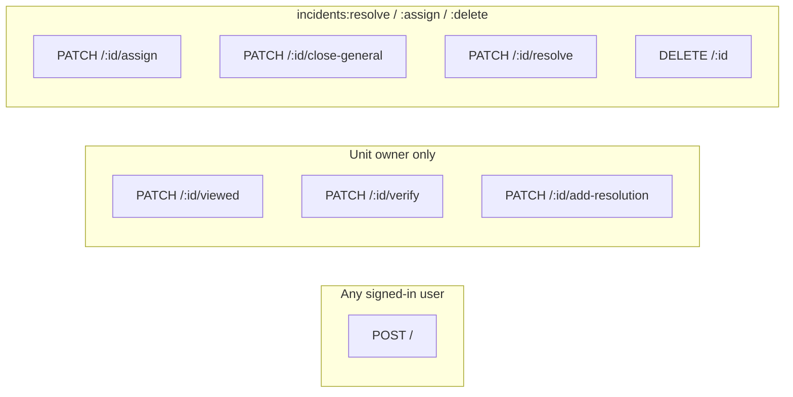
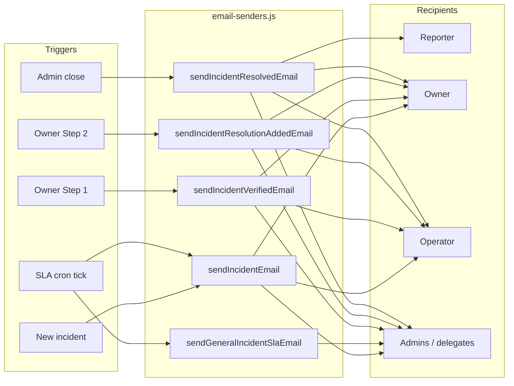
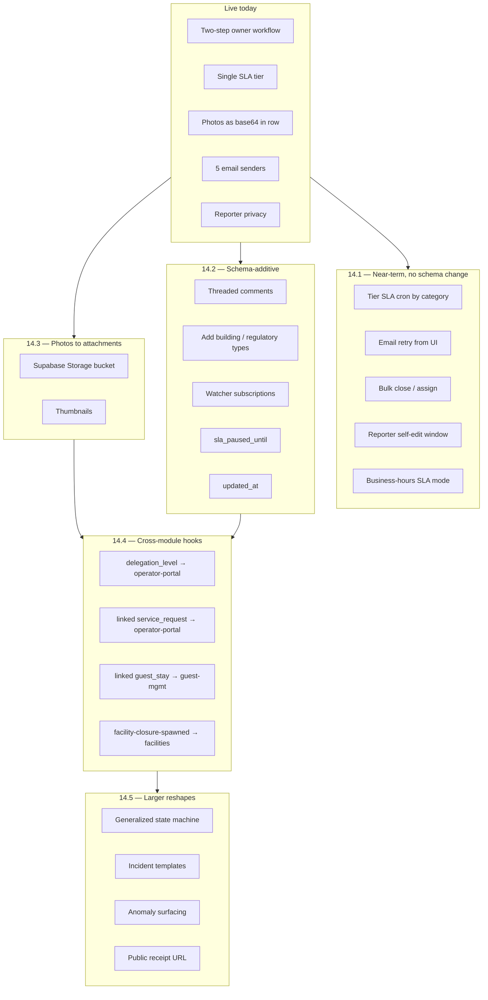

# `incidents` — Architecture Diagrams

> Companion to [`DESIGN.md`](DESIGN.md).
> All diagrams are Mermaid so they render natively on GitHub.

---

## 1. Unit-attached incident — state machine

The canonical owner-driven path. Both Step 1 and Step 2 are owner-only
today; Step 1+2 can be collapsed into a single action by supplying the
resolution text inside the verify modal.



---

## 2. General (community-wide) incident — state machine

`is_general = true`, `apt_id = null`. Admin chooses to assign to a unit
(folds into the canonical path) or close directly without an owner
workflow.



---

## 3. Entity relationships

The `incidents` table and the platform tables it joins onto. Reporter
identity (`reporter_uid`, `reporter_name`) is filtered server-side
before responses reach owner / operator viewers — see DESIGN.md §7.



---

## 4. End-to-end lifecycle (sequence)

From report → SLA escalations → owner steps → admin close. Each email
send is per-recipient so reporter identity can be conditionally
included or omitted.

```mermaid
sequenceDiagram
    actor R as Reporter
    actor O as Unit Owner
    actor A as Admin
    participant API as Server (incidents router)
    participant DB as Supabase
    participant Cron as SLA cron (~15 min)
    participant E as Email (Resend)

    R->>API: POST / (new incident)
    API->>DB: INSERT incidents (status=open,<br/>next_sla_reminder_at = now + sla_hours)
    API->>E: incident_new<br/>(admins, owner; reporter redacted for owner)

    loop while next_sla_reminder_at &le; now
      Cron->>DB: SELECT overdue rows
      Cron->>E: incident_sla<br/>(pendingStep = step1 or step2)
      Cron->>DB: UPDATE sla_cycle_count,<br/>next_sla_reminder_at += sla_hours
    end

    O->>API: PATCH /:id/verify (Step 1)
    API->>DB: UPDATE owner_guests, owner_comments,<br/>status=verified, owner_verified_at
    API->>E: incident_verified

    O->>API: PATCH /:id/add-resolution (Step 2)
    API->>DB: UPDATE owner_resolution,<br/>owner_resolution_at,<br/>next_sla_reminder_at = null
    API->>E: incident_resolution_added

    A->>API: PATCH /:id/resolve
    API->>DB: UPDATE status=resolved,<br/>resolved_at, resolved_by,<br/>resolution_comments
    API->>E: incident_resolved (all parties + reporter)
```

---

## 5. SLA cron decision flow

What `server/modules/incidents/sla-cron.js` does on each tick.



---

## 6. Permission gates per endpoint

Visual mapping of who can hit which route.



---

## 7. Email senders fan-out

Five senders in `server/modules/incidents/email-senders.js`, each gated
by `app_config.email_notifications`. Reporter inclusion is per-recipient,
not per-template.



---

## 8. Roadmap shape

How the §14 roadmap items map to the existing architecture. Each band
is one tranche from DESIGN.md §14.



---

*Update these diagrams when the module's shape or roadmap shifts.*
