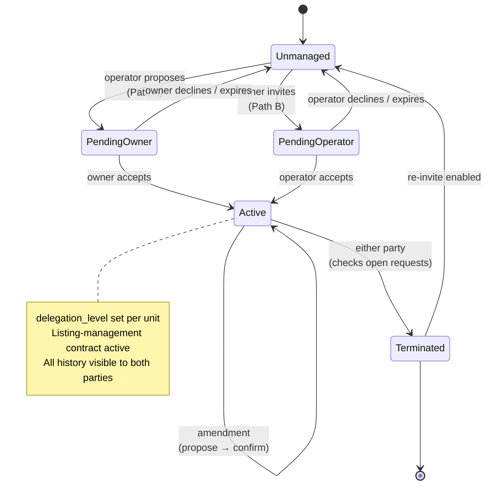
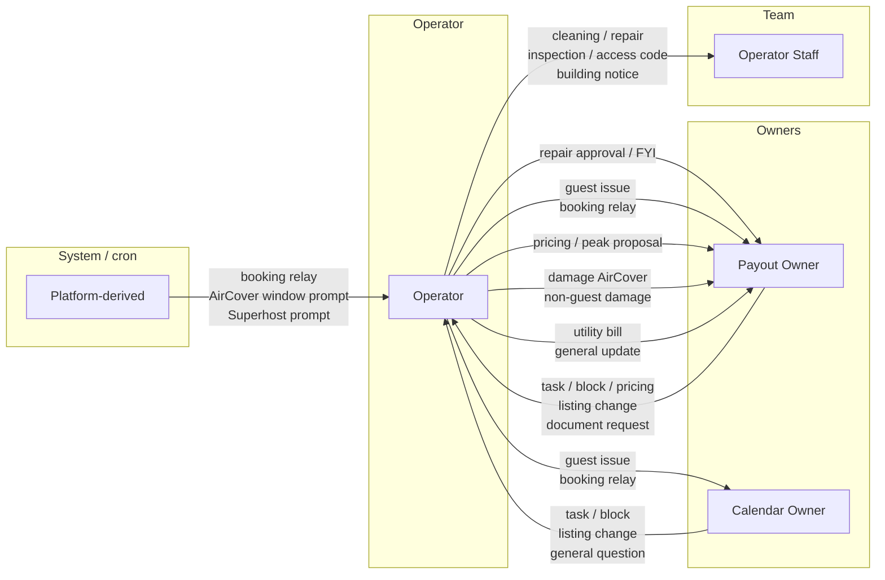
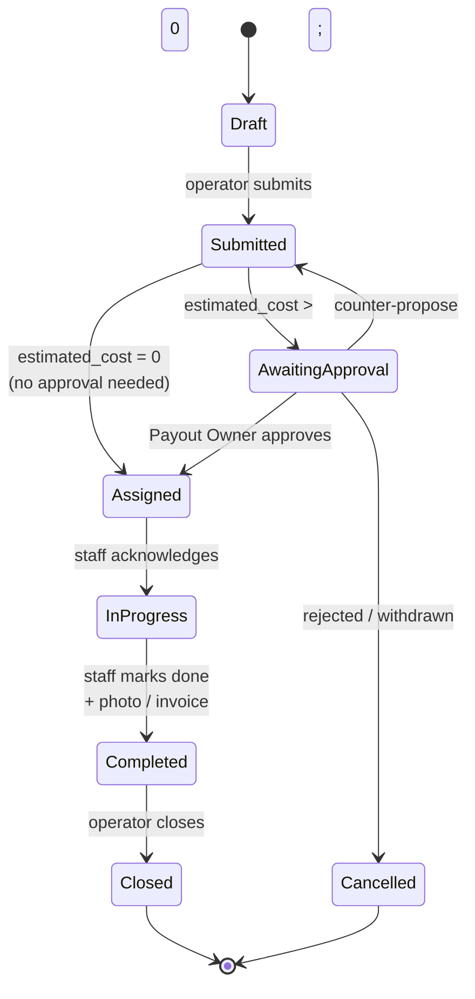
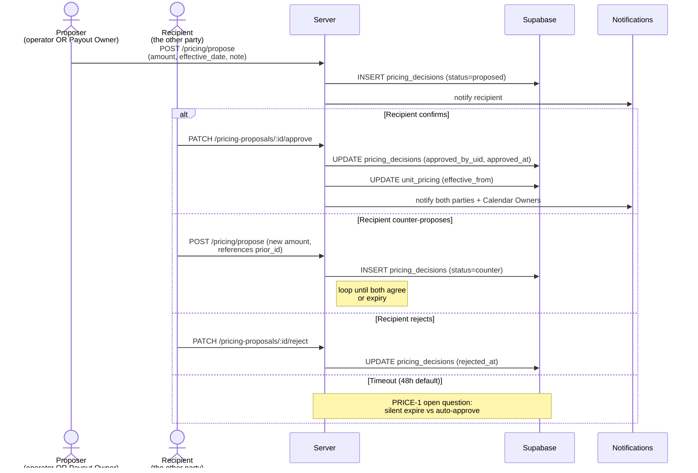
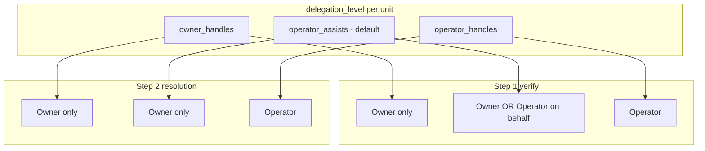
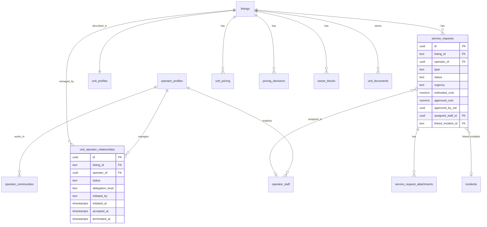
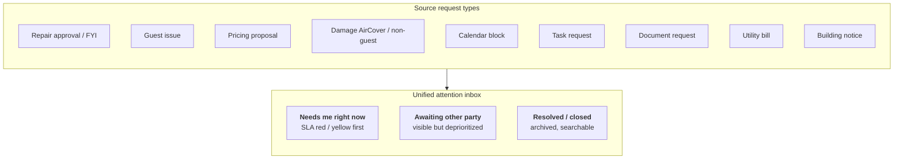
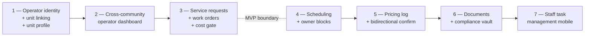

# `operator-portal` — Architecture Diagrams

> Companion to [`DESIGN.md`](DESIGN.md), [`USE_CASE_DISCOVERY.md`](USE_CASE_DISCOVERY.md), and [`PROPOSAL.md`](PROPOSAL.md).
> All diagrams are Mermaid so they render natively on GitHub.
>
> **Status:** these diagrams describe the **proposed** module. None of
> the data flows or tables exist in the codebase yet.

---

## 1. Operator ↔ owner relationship lifecycle

`unmanaged → pending → active → terminated`. Either party can initiate;
only the owner can finally accept on Path A; only the operator on Path
B. "Already managed" is a hard block — see DESIGN.md §"Establishment".



---

## 2. Roles and their relationship to a unit

One operator manages a unit. Owners split into Payout (financial) and
Calendar (operational, $$ hidden). Staff are cross-unit and may or may
not have a platform login.

```mermaid
flowchart TB
    Unit["Unit"]
    Op["Operator<br/>(0..1 active per unit;<br/>1..N units across communities)"]
    PO["Payout Owner<br/>(exactly 1 per unit;<br/>financial approval)"]
    CO["Calendar Owner<br/>(0..N per unit;<br/>$$ hidden, full thread)"]
    Staff["Operator Staff<br/>(0..N per operator;<br/>cross-unit, optional account)"]

    Op -- manages --&gt; Unit
    PO -- approves financial<br/>full thread --&gt; Unit
    CO -- sees calendar<br/>full thread --&gt; Unit
    Op -- employs --&gt; Staff
    Staff -. assignable to .-&gt; Unit
```

---

## 3. Request flow direction (the request taxonomy)

Who initiates which request type. Full table with WhatsApp equivalents
in [`USE_CASE_DISCOVERY.md`](USE_CASE_DISCOVERY.md) §"Request Type
Taxonomy".



---

## 4. Service request — state machine

The state machine for a single request (repair, cleaning, inspection,
etc.). The cost-approval gate is enforced when `estimated_cost > 0`.



---

## 5. Pricing proposal — bidirectional confirmation

Either party can propose; the other must confirm. All proposals,
counter-proposals, confirmations, and rejections are logged immutably
in `pricing_decisions`.



---

## 6. Delegation matrix → incidents module

How the per-unit `delegation_level` field affects who can advance the
incidents-module two-step workflow.



Every operator action carries the audit attribution
`"[Operator Name] acting on behalf of [Owner Name] — Unit [APT]"`.
Reporter privacy still applies: operators do **not** see
`reporter_uid` / `reporter_name`.

---

## 7. Entity relationships (proposed)

The new tables this module owns. All hang off `listings` (the platform
`units` entity). Service requests can optionally link to an existing
incident record.



---

## 8. The unified attention inbox

Both the operator and the owner see the same concept: *"What needs me
right now?"* Items where the ball is in your court are surfaced first;
SLA timers age yellow → red.



---

## 9. Implementation phasing

The seven phases from DESIGN.md. Recommended MVP is Phases 1–3 (the
WhatsApp-replacement core).



---

*Update these diagrams when the module's shape, request taxonomy, or
delegation model changes. Promote sections into separate diagrams files
if any of them grow large enough to warrant their own page.*
