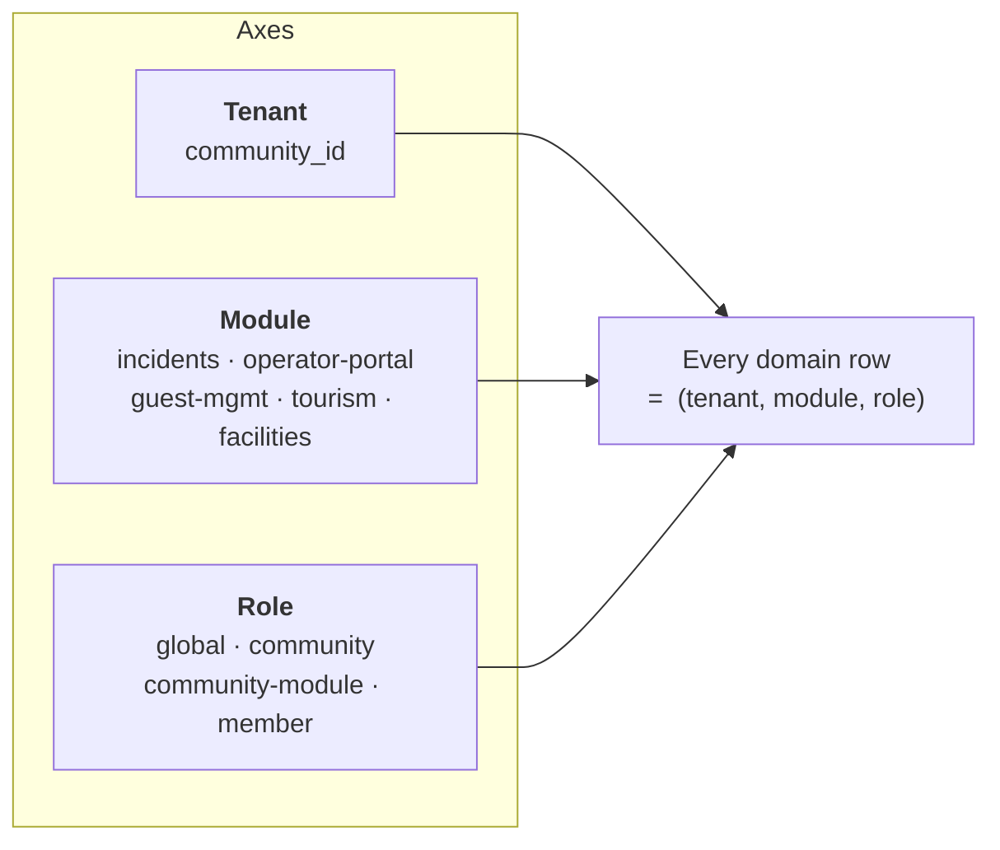
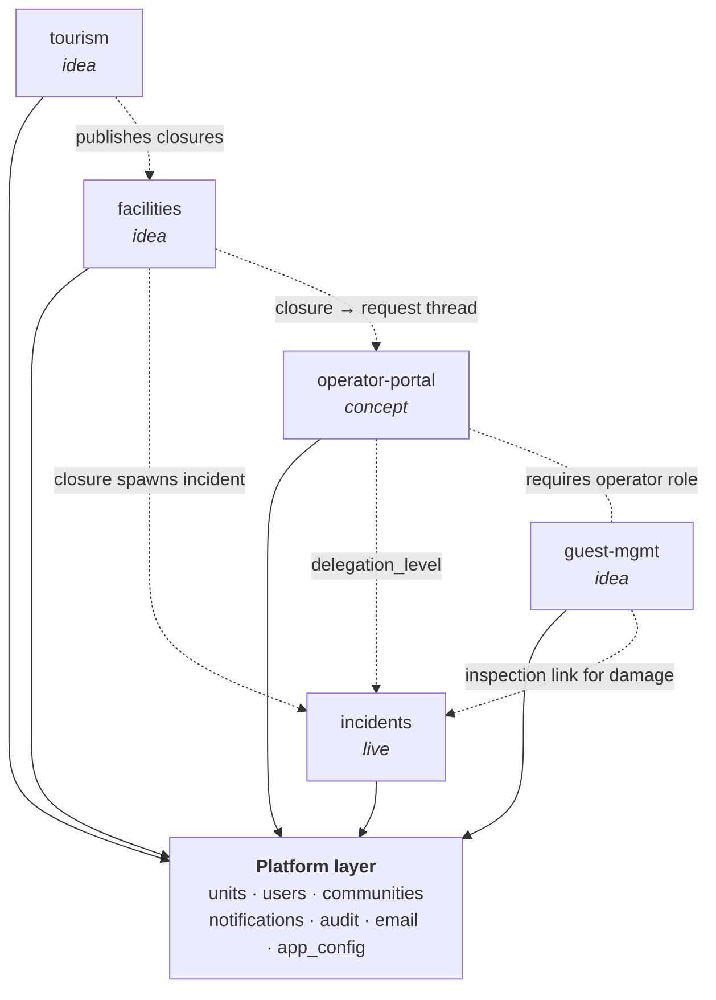
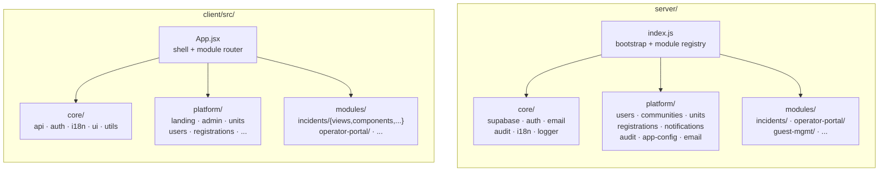
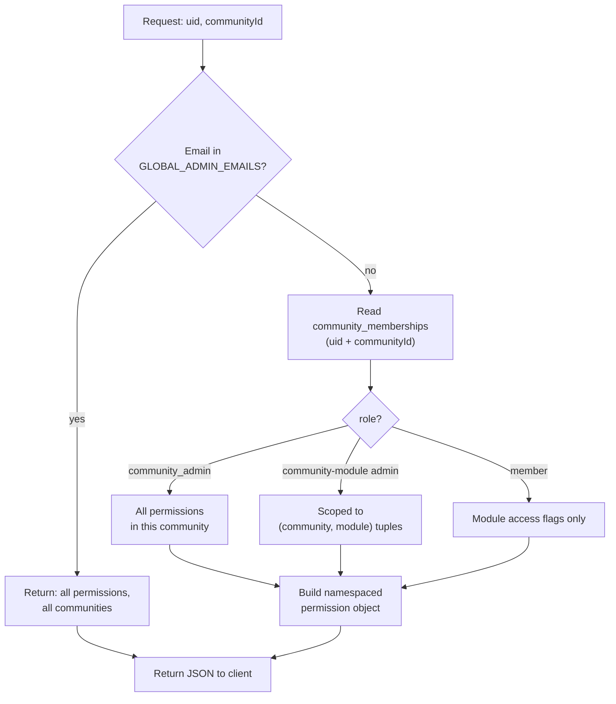
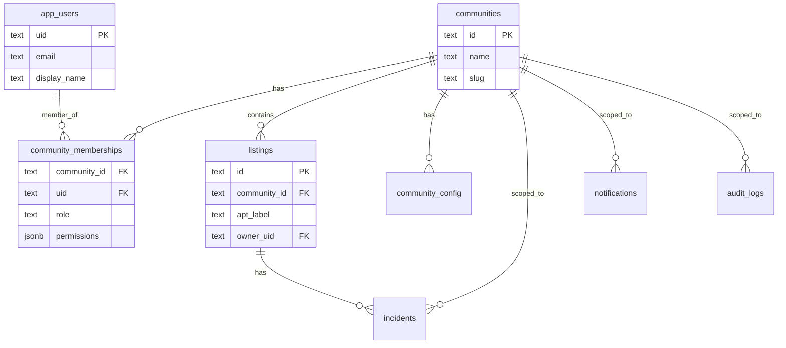
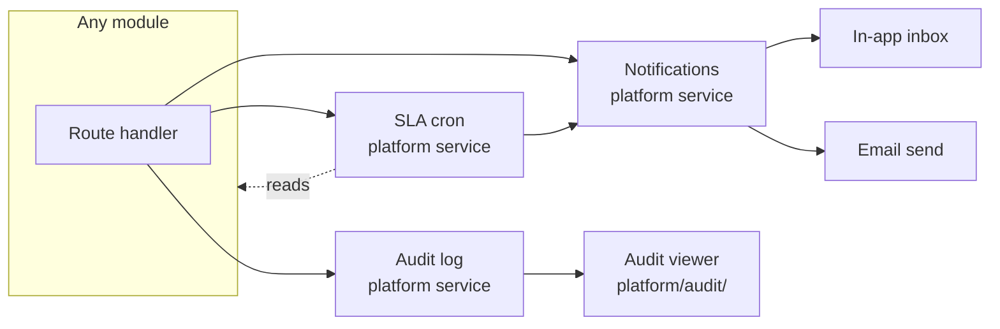

# Platform — Architecture Diagrams

> Companion to [`DESIGN.md`](DESIGN.md) and [`./PLATFORM_ARCHITECTURE.md`](./PLATFORM_ARCHITECTURE.md).
> All diagrams are Mermaid so they render natively on GitHub.

---

## 1. Three orthogonal axes

Every domain row, route, permission, and UI view sits at the intersection
of `(tenant, module, role)`.



---

## 2. Module dependency graph

Solid arrows show "depends on platform layer." Dashed arrows show
optional cross-module integrations (link, do not duplicate).



---

## 3. Repository layout

The agreed target shape from [`./PLATFORM_ARCHITECTURE.md`](./PLATFORM_ARCHITECTURE.md) §9.



---

## 4. The module contract

Every module — live or planned — exposes the same shape on each side.

```mermaid
flowchart LR
    subgraph ServerMod["server/modules/&lt;slug&gt;/index.js"]
      direction TB
      S1["slug · name · version"]
      S2["routes (Express router)"]
      S3["permissions (capability list)"]
      S4["emailTemplates (es-CO + en)"]
      S5["auditEntities"]
      S6["schemaMigrations (optional)"]
    end
    subgraph ClientMod["client/src/modules/&lt;slug&gt;/index.js"]
      direction TB
      C1["slug · name"]
      C2["navItems (gated by perms)"]
      C3["routes (&lt;Route&gt; elements)"]
      C4["permissions (mirror server)"]
      C5["i18n"]
    end
    ServerMod -. shared slug .- ClientMod
```



---

## 5. HTTP request lifecycle

The path every state-changing API call takes through the platform.

```mermaid
sequenceDiagram
    actor U as User
    participant FE as Client (React)
    participant API as Express server
    participant Auth as resolvePermissions
    participant Mod as Module router
    participant DB as Supabase
    participant N as Notifications
    participant A as Audit log
    participant E as Email (Resend)

    U->>FE: action
    FE->>API: POST /api/m/&lt;slug&gt;/...
    API->>Auth: (uid, communityId)
    Auth-->>API: { platform: [...], &lt;module&gt;: { ... } }
    API->>Mod: route handler
    Mod->>DB: read/write domain rows
    Mod->>A: append audit_logs row
    Mod->>N: write notifications row(s)
    N-->>E: per-recipient email send
    E-->>DB: email_delivery_logs row
    Mod-->>FE: response
    FE-->>U: render
```

---

## 6. Permissions resolution

Server-side, in one place. The client never re-derives permissions.



---

## 7. Tenant model

A community is a single physical place. Units, members, and module rows
all hang off it.



---

## 8. Cross-cutting platform services

Three services every module plugs into. These are owned by the platform
layer and must not be reinvented inside a module.



---

*Update these diagrams when the inter-module surface changes; do not let
drift accumulate.*
